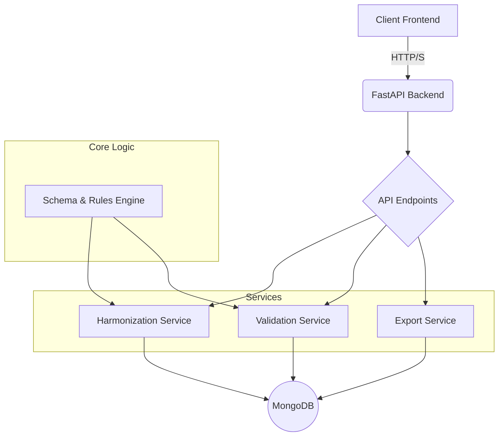

# Multiomic Data Orchestrator (MDO) - Backend Architecture

## 1. System Architecture Overview

The MDO backend will be a monolithic FastAPI application. It will handle file uploads, processing, validation, and data export. The architecture is designed to be simple, robust, and testable, with a clear separation of concerns.



## 2. MongoDB Schema Design

We will use the following collections in MongoDB:

*   **runs:** Stores information about each harmonization run.
    *   `_id`: ObjectId
    *   `user_id`: String
    *   `created_at`: DateTime
    *   `status`: String (e.g., 'uploading', 'mapping', 'harmonizing', 'validating', 'ready', 'exported')
    *   `files`: Array of ObjectId (references `uploaded_files`)
    *   `mapping_id`: ObjectId (references `mappings`)
    *   `validation_result_id`: ObjectId (references `validation_results`)

*   **uploaded_files:** Stores metadata about uploaded files.
    *   `_id`: ObjectId
    *   `run_id`: ObjectId
    *   `filename`: String
    *   `s3_path`: String (or local path for MVP)
    *   `schema_template_id`: String (e.g., 'illumina_v1', '10x_v2')
    *   `created_at`: DateTime

*   **mappings:** Stores user-defined column mappings.
    *   `_id`: ObjectId
    *   `user_id`: String
    *   `name`: String (for reusable mappings)
    *   `schema_template_id`: String
    *   `mapping`: Object (e.g., `{"canonical_field": "csv_column"}`)
    *   `created_at`: DateTime

*   **validation_results:** Stores the results of a validation run.
    *   `_id`: ObjectId
    *   `run_id`: ObjectId
    *   `status`: String ('passed', 'failed')
    *   `blocker_count`: Integer
    *   `warning_count`: Integer
    *   `info_count`: Integer
    *   `errors`: Array of Objects
        *   `file_id`: ObjectId
        *   `row_index`: Integer
        *   `column_name`: String
        *   `severity`: String ('Blocker', 'Warning', 'Info')
        *   `rule_id`: String
        *   `description`: String

*   **audit_logs:** Stores audit trail information.
    *   `_id`: ObjectId
    *   `timestamp`: DateTime
    *   `user_id`: String
    *   `run_id`: ObjectId
    *   `action`: String (e.g., 'file_uploaded', 'mapping_saved', 'export_generated')
    *   `details`: Object

*   **canonical_entities:** Stores the harmonized data. We can use a single collection with a type field or separate collections for each entity. For the MVP, a single collection is simpler.
    *   `_id`: ObjectId
    *   `run_id`: ObjectId
    *   `entity_type`: String ('Block', 'Slide', 'ROI', 'Library', 'Run')
    *   `data`: Object (the harmonized data for the entity)

## 3. API Endpoint Specifications

All endpoints will be prefixed with `/api/v1`.

*   **POST /runs:** Create a new harmonization run.
*   **POST /runs/{run_id}/files:** Upload a file for a run.
*   **POST /runs/{run_id}/mapping:** Set the mapping for a run.
*   **GET /runs/{run_id}/mapping:** Get the mapping for a run.
*   **POST /runs/{run_id}/harmonize:** Trigger the harmonization process.
*   **GET /runs/{run_id}/validation:** Get the validation results for a run.
*   **GET /runs/{run_id}/export:** Export the harmonized data bundle.
*   **GET /schemas:** Get a list of available schema templates.

## 4. Data Models and Relationships

The core data model is the canonical entity graph: `Block -> Slide -> ROI/FOV -> Library -> Run`. These relationships will be enforced by the harmonization and validation services. The MongoDB documents will store references to each other using `ObjectId`.

## 5. Processing Pipeline Design

The processing pipeline will be a sequential, step-by-step process:

1.  **Upload:** The user uploads CSV files.
2.  **Schema Selection & Mapping:** The user selects a schema template for each file and maps the columns.
3.  **Harmonization:** The backend processes the files sequentially:
    *   Load Blocks and Slides, validate their relationship.
    *   Load ROI/FOV data, link to Slides.
    *   Load Library data, link to ROI/FOV.
    *   Load Run data, link to Libraries.
4.  **Validation:** The rules engine validates the harmonized data.
5.  **Remediation:** The user downloads the validation report, fixes the data, and re-uploads.
6.  **Export:** Once there are no blockers, the user can export the data bundle.

## 6. Schema Template Structure

Schema templates will be defined as Python objects (e.g., using Pydantic) or JSON files within the `/backend/schemas` directory. This keeps them version-controlled and avoids database complexity for the MVP.

Example `illumina_run_v1.json`:
```json
{
  "id": "illumina_run_v1",
  "name": "Illumina NGS Run",
  "version": "1.0",
  "fields": [
    {
      "name": "Run_ID",
      "type": "string",
      "required": true
    },
    {
      "name": "Sample_ID",
      "type": "string",
      "required": true
    }
  ]
}
```

## 7. Rules Engine Design

The rules engine will be a set of functions that take the harmonized data as input and return a list of validation errors. Rules will be organized by level:

*   **Field-level:** Type checks, regex patterns, enum validation.
*   **Row-level:** Cross-field consistency.
*   **Table-level:** Uniqueness constraints.
*   **Relationship-level:** Referential integrity.

Each rule will have a unique ID, a severity, and a human-readable description.

## 8. File Structure Recommendations

The `/backend` directory will be structured as follows:

```
/backend
|-- app
|   |-- __init__.py
|   |-- main.py
|   |-- api
|   |   |-- __init__.py
|   |   |-- endpoints
|   |       |-- __init__.py
|   |       |-- runs.py
|   |       |-- schemas.py
|   |-- core
|   |   |-- __init__.py
|   |   |-- config.py
|   |-- db
|   |   |-- __init__.py
|   |   |-- database.py
|   |-- models
|   |   |-- __init__.py
|   |   |-- run.py
|   |-- schemas
|   |   |-- __init__.py
|   |   |-- templates
|   |       |-- illumina_run_v1.json
|   |-- services
|   |   |-- __init__.py
|   |   |-- harmonization.py
|   |   |-- validation.py
|   |   |-- export.py
|-- tests
|-- .gitignore
|-- Dockerfile
|-- requirements.txt
|-- README.md